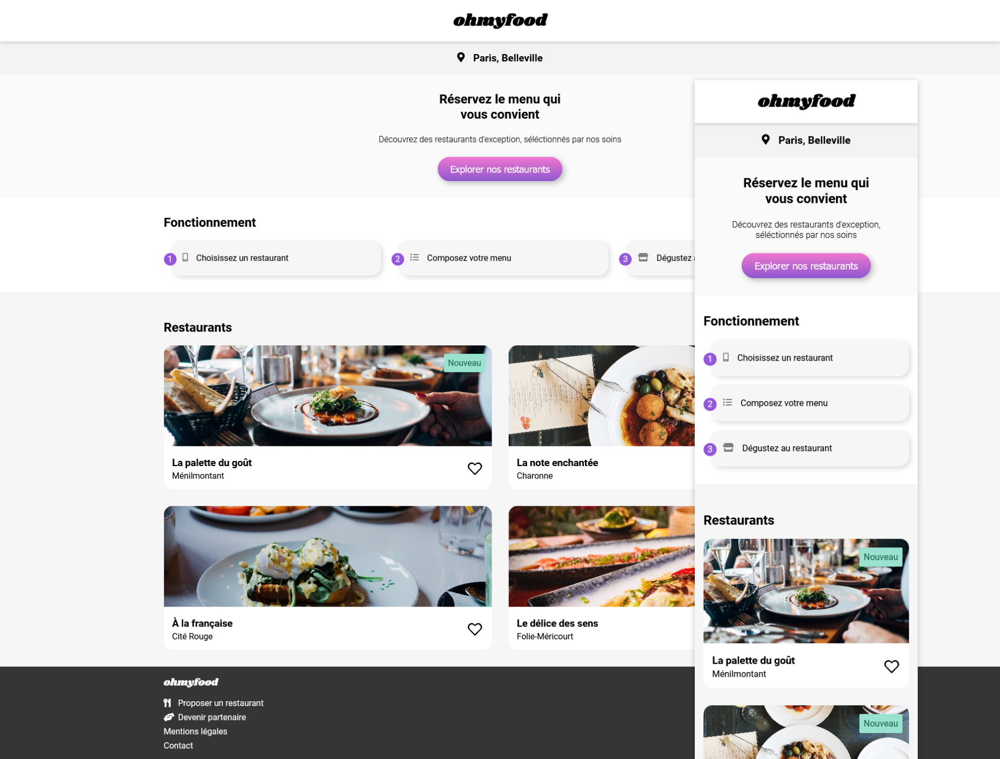
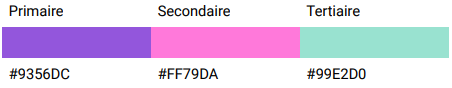

# Projet 3 OpenClassroom "Ohmyfood"

[Lien du site web](https://mmarichy.github.io/Ohmyfood/)

Quatrièmes projet du parcours "Intégrateur web" chez OpenClassroom. L'objectif est de développer puis de dynamiser une page web avec des animations CSS en utilisant le préprocesseur Sass.

Vous pouvez retrouver le [brief complet ici](https://course.oc-static.com/projects/D%C3%A9veloppeur+Web/IW_P4+Animations+CSS+Ohmyfood/Brief+creatif+site+Ohmyfood.pdf)

## Objectifs

1. Développer un site proposant le menu de 4 grands restaurants parisiens.
2. Permettre la réservation en ligne et la composition de menus.

## Livrables

### Pages à intégrer selon les maquettes

- **Page d’accueil**
- **Pages de menu (x4)**

#### Page d'accueil
- Affichage de la localisation des restaurants. À terme, il sera possible de choisir sa
localisation pour trouver des restaurants proches d’un certain lieu.
- Une courte présentation de l’entreprise.
- Une section contenant les 4 menus sous forme de cartes. Au clic sur la carte,
l’utilisateur est redirigé vers la page du menu.

##### Footer 
- Le footer est identique sur toutes les pages.
- Au clic sur “Contact”, un renvoi vers une adresse mail est effectué.

##### Header 
- Le header est présent sur toutes les pages.
- Sur la page d’accueil, il contient le logo du site.

#### Pages de menu 
- 4 pages contenant chacune le menu d’un restaurant.

##### Header 
- Sur les pages de menu, il contient en plus un bouton de retour vers la page d’accueil.

### Animation
- Les effets accessibles au clic ou au survol sont visibles sur la maquette. Ils devront utiliser
les animations ou transitions CSS, pas de JavaScript ni de librairie. Pour toutes les
animations, afin de soigner le rendu du site, il est important que lorsque nous avons un effet
au hover ou lors d’un clic, nous ayons l’effet inverse lorsque l’on quitte le survol.

**Boutons**
- Au survol, la couleur de fond des boutons principaux devra légèrement s’éclaircir. L’ombre portée devra également être plus visible.
- À terme, les visiteurs pourront sauvegarder leurs menus préférés. Pour ça, un
bouton "J’aime" en forme de cœur est présent sur la maquette. Au clic, il devra se
remplir progressivement. Pour cette première version, l’effet peut apparaître au
survol sur desktop au lieu du clic.

**Page d'acceuil**
- Quand l’application aura plus de menus, un “loader” sera nécessaire. Sur cette
maquette, nous souhaitons en avoir un aperçu. Il devra apparaître pendant 1 à 3
secondes quand on arrive sur la page d'accueil, couvrir l'intégralité de l'écran, et
utiliser les animations CSS (pas de librairie). Le design de ce loader n’est pas défini,
toute proposition est donc la bienvenue tant qu’elle est cohérente avec la charte
graphique du site.

**Pages de menu**
- À l’arrivée sur la page, les plats devront apparaître progressivement avec un léger
décalage dans le temps. Ils pourront apparaître soit un par un, soit par groupe
“Entrée”, “Plat” et “Dessert”.
- Le visiteur peut ajouter les plats qu'il souhaite à sa commande en cliquant dessus.
Cela fait apparaître une petite coche à droite du plat. Cette coche devra coulisser de
la droite vers la gauche. Pour cette première version, l’effet peut apparaître au survol
sur desktop au lieu du clic. Si l’intitulé du plat est trop long, il devra être rogné avec
des points de suspension.

## Technologies

- Le développement doit se faire en CSS avec Sass, sans JavaScript.

- Les fichiers sources .scss ainsi que le code compilé CSS doivent être disponibles
dans un ou plusieurs fichiers dédiés.

- Le site devra être réalisé en adoptant le Mobile First, c’est-à-dire qu’il faudra d’abord
réaliser l'intégration de la maquette mobile, puis tablette, et enfin l'intégration du
responsive vers le desktop.

- Aucun framework ne devra être utilisé (comme Bootstrap par exemple).

- Aucun code CSS ne doit être appliqué via un attribut style dans une balise HTML.

- Tout le code doit être versionné sur GitHub avec des commits réguliers pour
suivre l’avancement et publier le site en ligne plus facilement.

- Le site devra être accessible sur GitHub une fois terminé.

## Notes

**Polices :**
- Logo et titres : Shrikhand
- Texte : Roboto

**Couleurs :**

**Contraintes :**
- Approche mobile-first: oui
- Maquette mobile : oui
- Validation W3C HTML : à passer
- Validation W3C CSS : à passer
- Compatibilité : Dernières versions de Chrome, Firefox
- L’ensemble du site devra être responsive sur mobile, tablette et desktop.